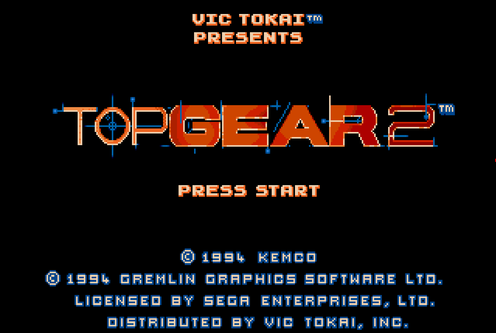
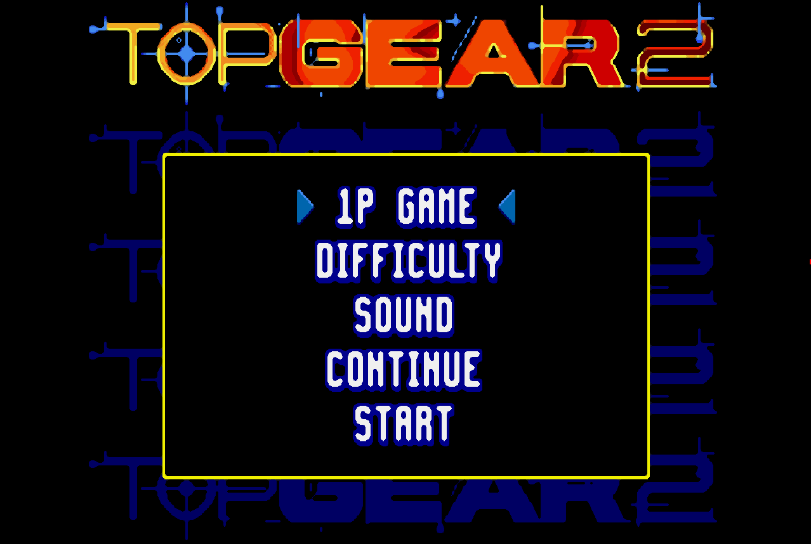
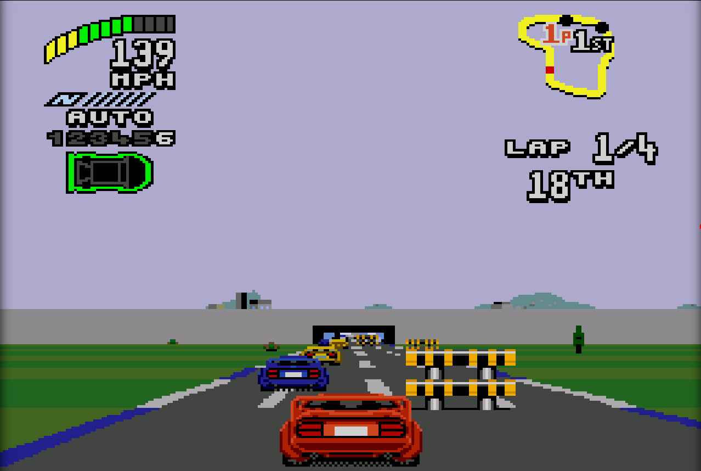
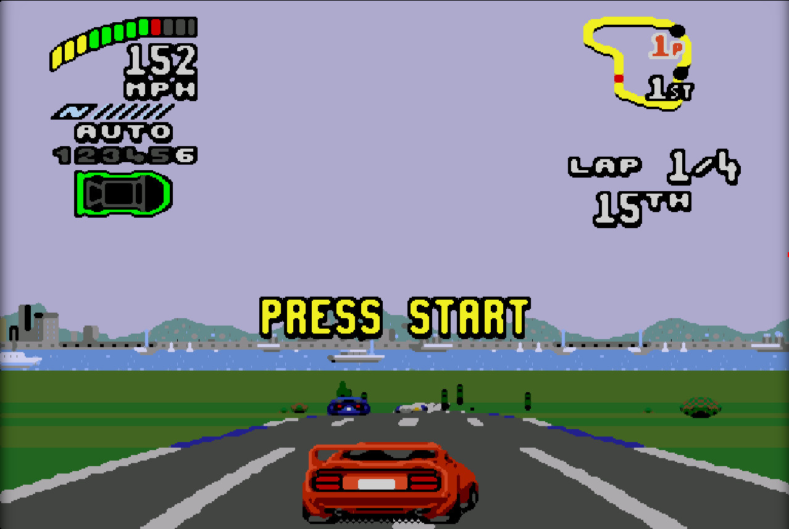
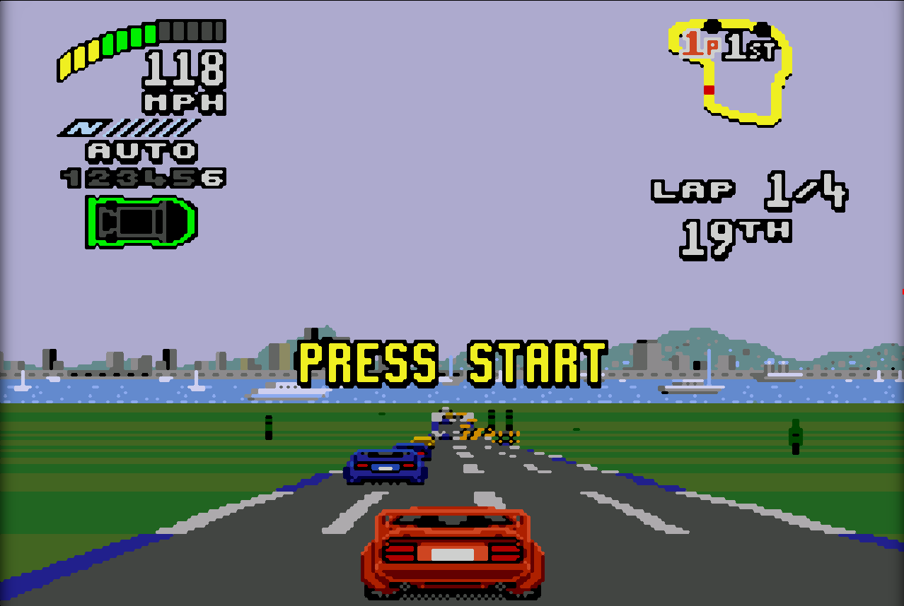
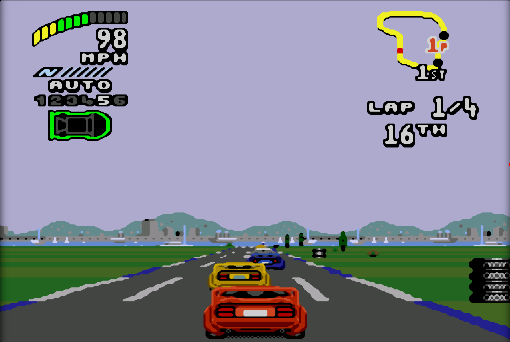

# obs-xbrz

## OBS XBRz-like shader fIlter

1. get a copy of [obs-shaderfilter](https://github.com/exeldro/obs-shaderfilter/releases) plugin and install it
2. place [files from this repo](./shaders) anywhere on your device
3. add a userdefined shader to your source's filter list
4. select the \*.effect file in the "load from file" 
5. toy with the settings!

## Samples 

Below are some samples from Top Gear 2 for SMD/Genesis with settings applied

### Title Screen
<table width=760px>
    <tr>
        <td> <b>no filter</b> </td>
        <td colspan=2> <b>scalefx-like</b> </td>
    </tr>
    <tr>
        <td>  </td>
        <td colspan=2>  </td>
    </tr>
    <tr>
        <td> no shader </td>
        <td colspan=2> 
            <u>Single pass</u>  
            <i>Sharpness:</i> -0.84,  
            <i>StartSmoothingWeight:</i> 1.00,  
            <i>MinFilterWeight:</i> 0.00, 
            <i>MaxFilterWeight:</i> 1.00, 
            <i>Smoothing:</i> 0.00, 
            <i>ScalingFactor:</i> 0.50, 
            <i>SamplingPointScale:</i> 0.50 
        </td>
    </tr>
    <tr>
        <td> <b>xbrz-like</b> </td>
        <td colspan=2> <b>two-pass</b> </td>
    </tr>
        <td>  </td>
        <td colspan=2>  </td>
    </tr>
    </tr>
        <td> 
            <u>Single pass</u>  
            <i>Sharpness:</i> -0.84,  
            <i>StartSmoothingWeight:</i> 1.00,  
            <i>MinFilterWeight:</i> 0.00, 
            <i>MaxFilterWeight:</i> 1.00, 
            <i>Smoothing:</i> 0.00, 
            <i>ScalingFactor:</i> 0.25, 
            <i>SamplingPointScale:</i> 1.00 
        </td>
        <td> 
            <u>First pass</u>  
            <i>Sharpness:</i> -0.84,  
            <i>StartSmoothingWeight:</i> 1.00,  
            <i>MinFilterWeight:</i> 0.00, 
            <i>MaxFilterWeight:</i> 1.00, 
            <i>Smoothing:</i> 0.00, 
            <i>ScalingFactor:</i> 0.25, 
            <i>SamplingPointScale:</i> 1.00 
        </td>
        <td> 
            <u>Second pass</u>  
            <i>Sharpness:</i> -0.84,  
            <i>StartSmoothingWeight:</i> 1.00,  
            <i>MinFilterWeight:</i> 0.00, 
            <i>MaxFilterWeight:</i> 1.00, 
            <i>Smoothing:</i> 0.00, 
            <i>ScalingFactor:</i> 0.50, 
            <i>SamplingPointScale:</i> 0.50 
        </td>
    </tr>
</table>
         
         

### Main Menu
<table width=760px>
    <tr>
        <td> <b>no filter</b> </td>
        <td colspan=2> <b>scalefx-like</b> </td>
    </tr>
    <tr>
        <td>  </td>
        <td colspan=2>  </td>
    </tr>
    <tr>
        <td> no shader </td>
        <td colspan=2> 
            <u>Single pass</u>  
            <i>Sharpness:</i> -0.84,  
            <i>StartSmoothingWeight:</i> 1.00,  
            <i>MinFilterWeight:</i> 0.00, 
            <i>MaxFilterWeight:</i> 1.00, 
            <i>Smoothing:</i> 0.00, 
            <i>ScalingFactor:</i> 0.50, 
            <i>SamplingPointScale:</i> 0.50 
        </td>
    </tr>
    <tr>
        <td> <b>xbrz-like</b> </td>
        <td colspan=2> <b>two-pass</b> </td>
    </tr>
        <td>  </td>
        <td colspan=2>  </td>
    </tr>
    </tr>
        <td> 
            <u>Single pass</u>  
            <i>Sharpness:</i> -0.84,  
            <i>StartSmoothingWeight:</i> 1.00,  
            <i>MinFilterWeight:</i> 0.00, 
            <i>MaxFilterWeight:</i> 1.00, 
            <i>Smoothing:</i> 0.00, 
            <i>ScalingFactor:</i> 0.25, 
            <i>SamplingPointScale:</i> 1.00 
        </td>
        <td> 
            <u>First pass</u>  
            <i>Sharpness:</i> -0.84,  
            <i>StartSmoothingWeight:</i> 1.00,  
            <i>MinFilterWeight:</i> 0.00, 
            <i>MaxFilterWeight:</i> 1.00, 
            <i>Smoothing:</i> 0.00, 
            <i>ScalingFactor:</i> 0.25, 
            <i>SamplingPointScale:</i> 1.00 
        </td>
        <td> 
            <u>Second pass</u>  
            <i>Sharpness:</i> -0.84,  
            <i>StartSmoothingWeight:</i> 1.00,  
            <i>MinFilterWeight:</i> 0.00, 
            <i>MaxFilterWeight:</i> 1.00, 
            <i>Smoothing:</i> 0.00, 
            <i>ScalingFactor:</i> 0.50, 
            <i>SamplingPointScale:</i> 0.50 
        </td>
    </tr>
</table>

### Gameplay
<table width=760px>
    <tr>
        <td> <b>no filter</b> </td>
        <td colspan=2> <b>scalefx-like</b> </td>
    </tr>
    <tr>
        <td>  </td>
        <td colspan=2>  </td>
    </tr>
    <tr>
        <td> no shader </td>
        <td colspan=2> 
            <u>Single pass</u>  
            <i>Sharpness:</i> -0.84,  
            <i>StartSmoothingWeight:</i> 1.00,  
            <i>MinFilterWeight:</i> 0.00, 
            <i>MaxFilterWeight:</i> 1.00, 
            <i>Smoothing:</i> 0.00, 
            <i>ScalingFactor:</i> 0.50, 
            <i>SamplingPointScale:</i> 0.50 
        </td>
    </tr>
    <tr>
        <td> <b>xbrz-like</b> </td>
        <td colspan=2> <b>two-pass</b> </td>
    </tr>
        <td>  </td>
        <td colspan=2>  </td>
    </tr>
    </tr>
        <td> 
            <u>Single pass</u>  
            <i>Sharpness:</i> -0.84,  
            <i>StartSmoothingWeight:</i> 1.00,  
            <i>MinFilterWeight:</i> 0.00, 
            <i>MaxFilterWeight:</i> 1.00, 
            <i>Smoothing:</i> 0.00, 
            <i>ScalingFactor:</i> 0.25, 
            <i>SamplingPointScale:</i> 1.00 
        </td>
        <td> 
            <u>First pass</u>  
            <i>Sharpness:</i> -0.84,  
            <i>StartSmoothingWeight:</i> 1.00,  
            <i>MinFilterWeight:</i> 0.00, 
            <i>MaxFilterWeight:</i> 1.00, 
            <i>Smoothing:</i> 0.00, 
            <i>ScalingFactor:</i> 0.25, 
            <i>SamplingPointScale:</i> 1.00 
        </td>
        <td> 
            <u>Second pass</u>  
            <i>Sharpness:</i> -0.84,  
            <i>StartSmoothingWeight:</i> 1.00,  
            <i>MinFilterWeight:</i> 0.00, 
            <i>MaxFilterWeight:</i> 1.00, 
            <i>Smoothing:</i> 0.00, 
            <i>ScalingFactor:</i> 0.50, 
            <i>SamplingPointScale:</i> 0.50 
        </td>
    </tr>
</table>